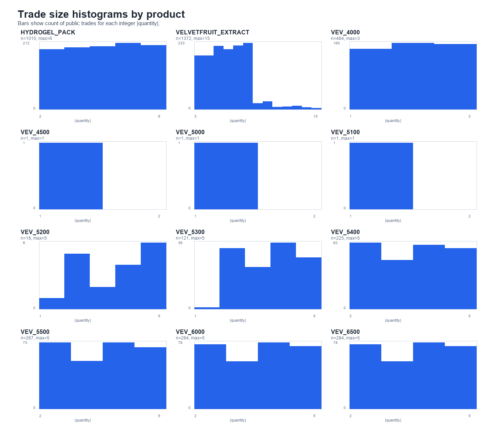
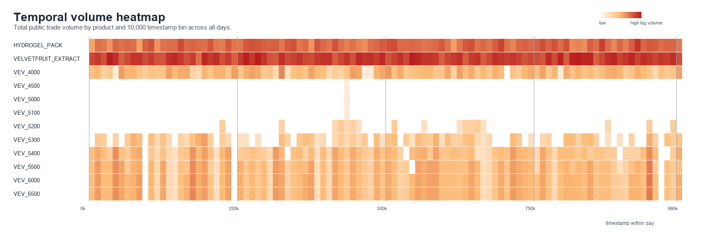
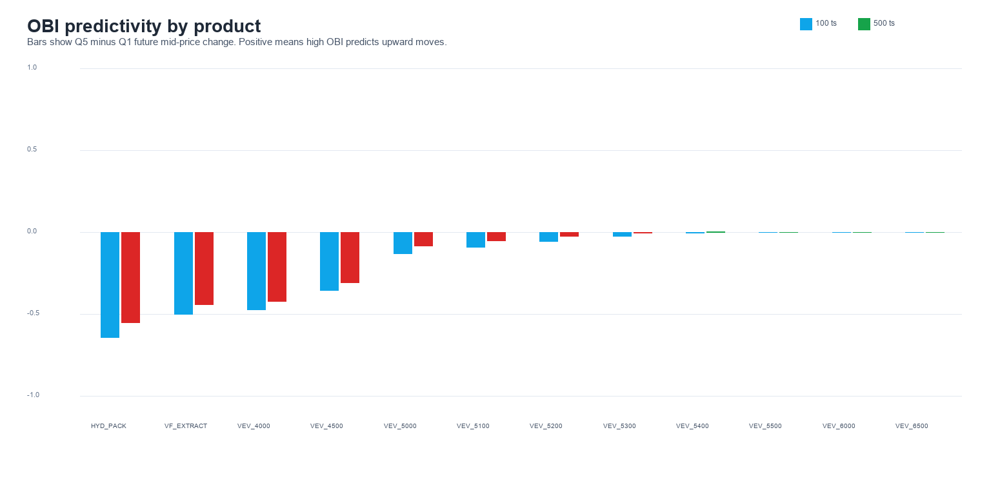
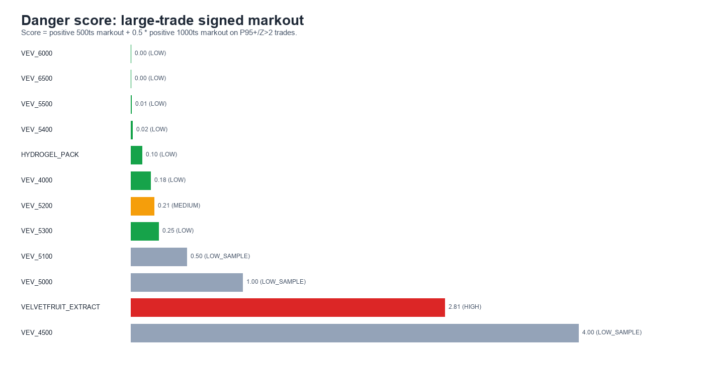

# R3 Microstructure & Informed Flow Report

## Executive summary

- **Produits dangereux:** VELVETFRUIT_EXTRACT (HIGH, m500=1.81), VEV_5200 (MEDIUM, m500=0.17)
- **Side-channel trader ID:** Aucun ID exploitable: 100% des champs buyer et seller sont vides dans ces fichiers. Le side-channel par identite n'est donc pas observable ici.
- **Fenetre MM plus calme:** 660,000-669,900, 670,000-679,900, 0-9,900, 330,000-339,900, 960,000-969,900. **A eviter / elargir:** 910,000-919,900, 280,000-289,900, 10,000-19,900, 640,000-649,900, 230,000-239,900.

## Methodologie

- Side des trades publics infere par comparaison du prix trade avec bid/ask L1, puis mid si besoin.
- Markout signe = side_agresseur * (mid futur - mid courant). Positif veut dire que le trade public etait adverse pour un market maker qui quote contre lui.
- Gros trade = taille >= P95 du produit ou Z-score taille > 2.
- OBI = (volume bid total L1-L3 - volume ask total L1-L3) / total volume L1-L3.
- Walls = niveaux de carnet avec volume strictement superieur au P90 du produit.

Dataset: 360,000 lignes de carnet, 4,048 trades publics, 12 produits.
Champs ID vides: buyer 100.0%, seller 100.0%.

## Charts

## Danger level par produit

| Product | Danger | Trades | Large sided | P95 size | M100 | M500 | M1000 | Hit rate 500 |
| --- | --- | --- | --- | --- | --- | --- | --- | --- |
| VELVETFRUIT_EXTRACT | HIGH | 1,372 | 78 | 10.00 | 1.85 | 1.81 | 2.00 | 0.78 |
| VEV_5200 | MEDIUM | 18 | 6 | 5.00 | 0.08 | 0.17 | 0.08 | 0.67 |
| VEV_5300 | LOW | 121 | 27 | 5.00 | 0.17 | 0.24 | 0.02 | 0.48 |
| VEV_4000 | LOW | 464 | 158 | 3.00 | 0.02 | 0.16 | 0.03 | 0.44 |
| HYDROGEL_PACK | LOW | 1,010 | 205 | 6.00 | -0.30 | -0.32 | 0.20 | 0.49 |
| VEV_5400 | LOW | 225 | 57 | 5.00 | 0.01 | 0.02 | -0.09 | 0.32 |
| VEV_5500 | LOW | 267 | 68 | 5.00 | 0.05 | 0.01 | -0.02 | 0.10 |
| VEV_6000 | LOW | 284 | 74 | 5.00 | 0.00 | 0.00 | 0.00 | 0.00 |
| VEV_6500 | LOW | 284 | 74 | 5.00 | 0.00 | 0.00 | 0.00 | 0.00 |
| VEV_4500 | LOW_SAMPLE | 1 | 1 | 1.00 | 7.50 | 2.50 | 3.00 | 1.00 |
| VEV_5000 | LOW_SAMPLE | 1 | 1 | 1.00 | 3.00 | 0.50 | 1.00 | 1.00 |
| VEV_5100 | LOW_SAMPLE | 1 | 1 | 1.00 | 2.00 | 0.00 | 1.00 | 0.00 |

## Distribution des tailles

| Product | Trades | Median | Mean | P95 | Max |
| --- | --- | --- | --- | --- | --- |
| VELVETFRUIT_EXTRACT | 1,372 | 6.00 | 6.03 | 10.00 | 15 |
| HYDROGEL_PACK | 1,010 | 4.00 | 4.04 | 6.00 | 6 |
| VEV_5200 | 18 | 4.00 | 3.50 | 5.00 | 5 |
| VEV_5300 | 121 | 4.00 | 3.47 | 5.00 | 5 |
| VEV_5400 | 225 | 4.00 | 3.50 | 5.00 | 5 |
| VEV_5500 | 267 | 4.00 | 3.51 | 5.00 | 5 |
| VEV_6000 | 284 | 4.00 | 3.53 | 5.00 | 5 |
| VEV_6500 | 284 | 4.00 | 3.53 | 5.00 | 5 |
| VEV_4000 | 464 | 2.00 | 2.03 | 3.00 | 3 |
| VEV_4500 | 1 | 1.00 | 1.00 | 1.00 | 1 |
| VEV_5000 | 1 | 1.00 | 1.00 | 1.00 | 1 |
| VEV_5100 | 1 | 1.00 | 1.00 | 1.00 | 1 |

## Patterns temporels

### Bins preferables pour MM

| TS bin | Total volume | Large trade M500 | Risk score |
| --- | --- | --- | --- |
| 660,000-669,900 | 113 | -1.00 | 0.13 |
| 670,000-679,900 | 120 | -2.00 | 0.14 |
| 0-9,900 | 128 | -6.25 | 0.15 |
| 330,000-339,900 | 134 | -1.00 | 0.17 |
| 960,000-969,900 | 134 | -2.12 | 0.17 |
| 750,000-759,900 | 138 | -0.33 | 0.18 |
| 400,000-409,900 | 139 | -2.00 | 0.19 |
| 780,000-789,900 | 145 | 0.00 | 0.22 |

### Bins les plus chauds

| TS bin | Total volume | Large trade M500 |
| --- | --- | --- |
| 940,000-949,900 | 279 | -0.50 |
| 190,000-199,900 | 247 | -0.94 |
| 40,000-49,900 | 235 | -0.50 |
| 840,000-849,900 | 235 | 0.33 |
| 280,000-289,900 | 230 | 1.75 |
| 170,000-179,900 | 229 | 0.41 |
| 550,000-559,900 | 227 | -1.28 |
| 320,000-329,900 | 225 | 0.59 |

### Bins les plus calmes

| TS bin | Total volume | Large trade M500 |
| --- | --- | --- |
| 240,000-249,900 | 95 | 0.40 |
| 110,000-119,900 | 98 | 1.50 |
| 660,000-669,900 | 113 | -1.00 |
| 90,000-99,900 | 114 | 4.00 |
| 300,000-309,900 | 120 | 1.25 |
| 670,000-679,900 | 120 | -2.00 |
| 850,000-859,900 | 120 | 2.70 |
| 0-9,900 | 128 | -6.25 |

### Correlations de volume inter-produits

| Product A | Product B | Corr |
| --- | --- | --- |
| VEV_6000 | VEV_6500 | 1.00 |
| VEV_4500 | VEV_5100 | 1.00 |
| VEV_4500 | VEV_5000 | 1.00 |
| VEV_5000 | VEV_5100 | 1.00 |
| VEV_5500 | VEV_6500 | 0.95 |
| VEV_5500 | VEV_6000 | 0.95 |
| VEV_5400 | VEV_6500 | 0.86 |
| VEV_5400 | VEV_6000 | 0.86 |
| VEV_5400 | VEV_5500 | 0.83 |
| VEV_5300 | VEV_6500 | 0.59 |
| VEV_5300 | VEV_6000 | 0.59 |
| VEV_5300 | VEV_5500 | 0.59 |

## OBI predictif

| Product | Q5-Q1 100 | Q5-Q1 500 | Predictive >2 | Q1 d500 | Q5 d500 |
| --- | --- | --- | --- | --- | --- |
| VEV_5400 | -0.01 | 0.00 | 0 | -0.00 | 0.00 |
| VEV_5500 | -0.00 | 0.00 | 0 | -0.00 | 0.00 |
| VEV_6000 | 0.00 | 0.00 | 0 | 0.00 | 0.00 |
| VEV_6500 | 0.00 | 0.00 | 0 | 0.00 | 0.00 |
| VEV_5300 | -0.03 | -0.01 | 0 | 0.01 | 0.00 |
| VEV_5200 | -0.06 | -0.03 | 0 | 0.03 | 0.01 |
| VEV_5100 | -0.09 | -0.05 | 0 | 0.05 | 0.00 |
| VEV_5000 | -0.13 | -0.09 | 0 | 0.07 | -0.02 |
| VEV_4500 | -0.36 | -0.31 | 0 | 0.19 | -0.12 |
| VEV_4000 | -0.47 | -0.42 | 0 | 0.24 | -0.18 |
| VELVETFRUIT_EXTRACT | -0.50 | -0.44 | 0 | 0.28 | -0.16 |
| HYDROGEL_PACK | -0.64 | -0.55 | 0 | 0.28 | -0.27 |

## Identification traders

Aucun top trader ID ne peut etre calcule: tous les champs `buyer` et `seller` sont vides.
Le script exporte quand meme `tables/trader_stats.csv` pour garder le workflow reproductible si une version des donnees contient les IDs.

## Wall dynamics

| Product | P90 vol | Wall instances | Median life ts | Hits | Hit M100 | In-dir rate |
| --- | --- | --- | --- | --- | --- | --- |
| VEV_5400 | 27.00 | 4,785 | 100.00 | 1 | 0.00 | 0.00 |
| VEV_5500 | 27.00 | 4,887 | 100.00 | 1 | 0.00 | 0.00 |
| VEV_6000 | 27.00 | 4,941 | 100.00 | 1 | 0.00 | 0.00 |
| VELVETFRUIT_EXTRACT | 64.00 | 7,624 | 100.00 | 146 | -0.34 | 0.28 |
| HYDROGEL_PACK | 28.00 | 10,640 | 100.00 | 0 |  |  |
| VEV_4000 | 27.00 | 10,500 | 100.00 | 0 |  |  |
| VEV_4500 | 22.00 | 8,724 | 100.00 | 0 |  |  |
| VEV_5000 | 28.00 | 7,763 | 100.00 | 0 |  |  |
| VEV_5100 | 30.00 | 7,662 | 100.00 | 0 |  |  |
| VEV_5200 | 32.00 | 4,779 | 100.00 | 0 |  |  |
| VEV_5300 | 27.00 | 4,360 | 100.00 | 0 |  |  |
| VEV_6500 | 19.00 | 4,080 | 100.00 | 0 |  |  |

## Asymetrie buy/sell inferee

| Product | Buy trades | Sell trades | Unknown | Count ratio | Volume ratio | Tilt |
| --- | --- | --- | --- | --- | --- | --- |
| VELVETFRUIT_EXTRACT | 781 | 591 | 0 | 1.32 | 1.47 | balanced |
| HYDROGEL_PACK | 524 | 486 | 0 | 1.08 | 1.08 | balanced |
| VEV_4000 | 226 | 238 | 0 | 0.95 | 0.94 | balanced |
| VEV_5200 | 1 | 17 | 0 | 0.06 | 0.02 | sell-heavy |
| VEV_5300 | 1 | 119 | 1 | 0.01 | 0.00 | sell-heavy |
| VEV_5400 | 0 | 225 | 0 | 0.00 | 0.00 | sell-heavy |
| VEV_5500 | 0 | 267 | 0 | 0.00 | 0.00 | sell-heavy |
| VEV_6000 | 0 | 284 | 0 | 0.00 | 0.00 | sell-heavy |
| VEV_6500 | 0 | 284 | 0 | 0.00 | 0.00 | sell-heavy |
| VEV_4500 | 1 | 0 | 0 |  |  | unknown |
| VEV_5000 | 1 | 0 | 0 |  |  | unknown |
| VEV_5100 | 1 | 0 | 0 |  |  | unknown |

## Recommandations MM concretes

| Product | Danger | Median spread | Min edge | OBI action | Flow tilt | Avoid bins |
| --- | --- | --- | --- | --- | --- | --- |
| VELVETFRUIT_EXTRACT | HIGH | 5.00 | 3 | OBI weak; keep neutral | balanced | 910,000-919,900, 280,000-289,900, 10,000-19,900, 640,000-649,900, 230,000-239,900 |
| VEV_5200 | MEDIUM | 3.00 | 1 | OBI weak; keep neutral | sell-heavy | 910,000-919,900, 280,000-289,900, 10,000-19,900, 640,000-649,900, 230,000-239,900 |
| VEV_5300 | LOW | 2.00 | 1 | OBI weak; keep neutral | sell-heavy | 910,000-919,900, 280,000-289,900, 10,000-19,900, 640,000-649,900, 230,000-239,900 |
| VEV_4000 | LOW | 21.00 | 6 | OBI weak; keep neutral | balanced | 910,000-919,900, 280,000-289,900, 10,000-19,900, 640,000-649,900, 230,000-239,900 |
| HYDROGEL_PACK | LOW | 16.00 | 4 | OBI weak; keep neutral | balanced | 910,000-919,900, 280,000-289,900, 10,000-19,900, 640,000-649,900, 230,000-239,900 |
| VEV_5400 | LOW | 1.00 | 1 | OBI weak; keep neutral | sell-heavy | 910,000-919,900, 280,000-289,900, 10,000-19,900, 640,000-649,900, 230,000-239,900 |
| VEV_5500 | LOW | 1.00 | 1 | OBI weak; keep neutral | sell-heavy | 910,000-919,900, 280,000-289,900, 10,000-19,900, 640,000-649,900, 230,000-239,900 |
| VEV_6000 | LOW | 1.00 | 1 | OBI weak; keep neutral | sell-heavy | 910,000-919,900, 280,000-289,900, 10,000-19,900, 640,000-649,900, 230,000-239,900 |
| VEV_6500 | LOW | 1.00 | 1 | OBI weak; keep neutral | sell-heavy | 910,000-919,900, 280,000-289,900, 10,000-19,900, 640,000-649,900, 230,000-239,900 |
| VEV_4500 | LOW_SAMPLE | 16.00 | 4 | OBI weak; keep neutral | unknown | 910,000-919,900, 280,000-289,900, 10,000-19,900, 640,000-649,900, 230,000-239,900 |
| VEV_5000 | LOW_SAMPLE | 6.00 | 2 | OBI weak; keep neutral | unknown | 910,000-919,900, 280,000-289,900, 10,000-19,900, 640,000-649,900, 230,000-239,900 |
| VEV_5100 | LOW_SAMPLE | 4.00 | 1 | OBI weak; keep neutral | unknown | 910,000-919,900, 280,000-289,900, 10,000-19,900, 640,000-649,900, 230,000-239,900 |

## Fichiers generes

- `tables/product_size_stats.csv`
- `tables/danger_table.csv`
- `tables/temporal_volume_by_product_bin.csv`
- `tables/temporal_bin_summary.csv`
- `tables/volume_correlations.csv`
- `tables/obi_predictivity.csv`
- `tables/obi_quintiles.csv`
- `tables/trader_stats.csv`
- `tables/wall_dynamics.csv`
- `tables/asymmetry.csv`
- `tables/mm_recommendations.csv`

## Limites

- Les buyer/seller IDs etant vides, toute conclusion sur un trader nomme est impossible avec ces fichiers.
- Le side public est infere, pas donne explicitement. Les trades au mid restent inconnus.
- Les walls sont observes sur snapshots 100 ts; une wall peut apparaitre/disparaitre entre deux snapshots.
